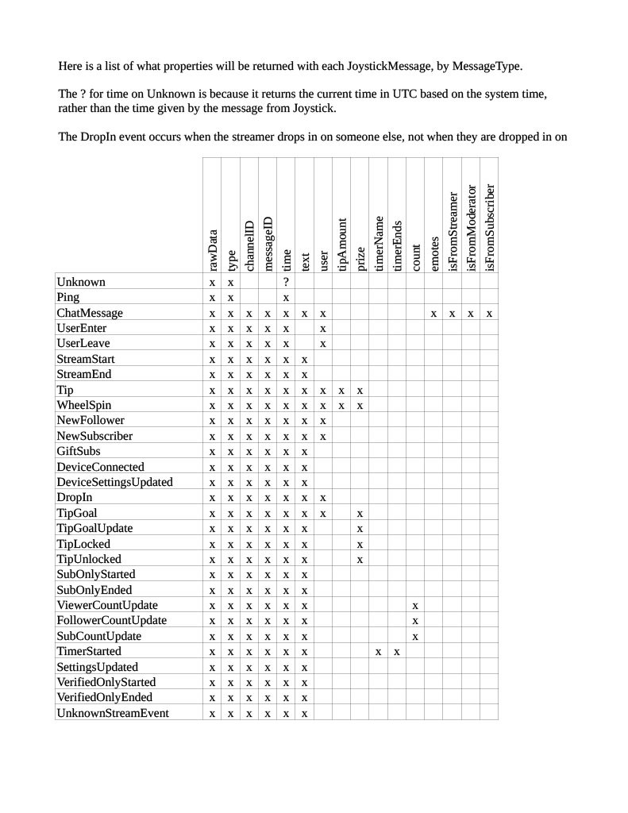

### Using the JoysticktvSocket Library

First you will need a joystick.tv account, and will need to create a bot at https://joystick.tv/applications by clicking Create Bot.  Fill out the form and make sure you give your bot the permissions it will need in this step, because permissions cannot be changed later. Upon clicking Submit Bot, you will be taken to a page with your **client ID** and **client secret**, which you will need to establish a connection with joystick.tv via websocket.

With your ID and secret, connecting is as easy as instantiating an object of the class **JoystickConnection** and opening the websocket using the **Connect()** method, like so:

    JoystickConnection jsSocket = new JoystickConnection();
    jsSocket.Connect(CLIENT_ID, CLIENT_SECRET);

and with that, your connection is established!

The Connect() method actually returns a JoystickWebsocketStatus if you would like to check that it is working properly, and what went wrong.  More on those below.

At any point you can check if the JoystickConnection websocket is open with the object’s boolean property **isSocketOpen**.

You can now use several methods of your JoystickConnection to interact with the chat of users who have this bot installed.  One of these is used to receive messages about chat, stream events, etc.  You can get those with the **Receive()** method on your JoystickConnection, which returns a JoystickMessage.

    JoystickMessage jsMessage = jsSocket.Receive();

Usually, if your bot does something in response to messages or events in chat, you will have the **Receive()** method being called in a loop such as a while loop checking the isSocketOpen property of your JoystickConnection object.  The loop will wait for the Receive() method to return a message, and then will do something in response to that message, before starting again at the beginning of the loop.

Once the JoystickMessage is received, there are many properties on it that can be checked to determine the contents and specifics of the message.

string **rawData** is the serialized JSON exactly as it was received from joystick.tv  
MessageType **type** is the type of the message, as one of the entries on the MessageType enum, below  
string? **user** is the user who sent the message or originated the event, if any  
int? **tipAmount** is the number of tokens tipped or spent on a wheel spin  
string? **prize** is result of the wheel spin, the goal that was met, or the item tipped for on a tip menu, as appropriate  
string? **channelID** is the unique ID of the channel where the message or event took place.  This is useful if the bot needs to post a message in that channel, whisper at a user there, etc.  
string? **messageID** is the unique ID of the message or event  
string? **text** is the text of a chat message, or the text displayed in chat with a stream event  
DateTime **time** is when the event took place, in UTC  
int? **count** the number of followers, subscribers, or viewers in an update event of any of those types  
string? **timerName** is the name of the timer created in this event  
DateTime **timerEnd** is the time in UTC that the timer will elapse  
(string **emote**, string **emoteUrl**)[]? **emotes** is an array of tuples, where each index stores the emote’s name (as typed in chat, such as “<3” or “:JoseyFoxSniff:”) and the url of the image  
bool? **isFromStreamer** marks if the sender is the streamer in this room  
bool? **isFromModerator** marks if the sender is a moderator in this room  
bool? **isFromSubscriber** marks if the sender is a subscriber in this room  
string? **streamEventType** and the following are becaust stream events will be added as the site develops, so users of this library can account for MessageTypes not covered here, and handle their metadata  
string? **streamEventMetadata**

Other than rawMessage, type, and time, all of these properties are nullable, so some explicit casting may be needed when using these properties.  timerEnd is also not nullable, so that you can easily call .ToLocalTime() on it, if need be.  If the event is not a timer start, it will return DateTime.Min

The MessageTypes in the MessageType enum are listed at the end of this document, with which JoystickMessage properties are attached to each type

In addition to receiving data, you can send messages to the joystick websocket, also through the JoystickConnection object.

**ChatMessage(** string channelID, string message **)**  
**Whisper(** string user, string channelID, string message **)**  
**SilenceUser(** string messageID, string channelID **)**  
**UnsilenceUser(** string user, string channelID **)**  
**BlockUser(** string messageID, string channelID **)**  
**DeleteMessage(** string messageID, string channelID **)**  
**Close()**

All of these methods return a JoystickWebsocketStatus, which may be
- Success
- FailedInitialConnection
- FailedSocketSubscription
- SocketNotOpen
- NotValidChannelID
- NotValidMessageID

The last two only check that the channelID or messageID are formatted properly to fill that role, and do not ensure that they match with an extant message or channel ID.

